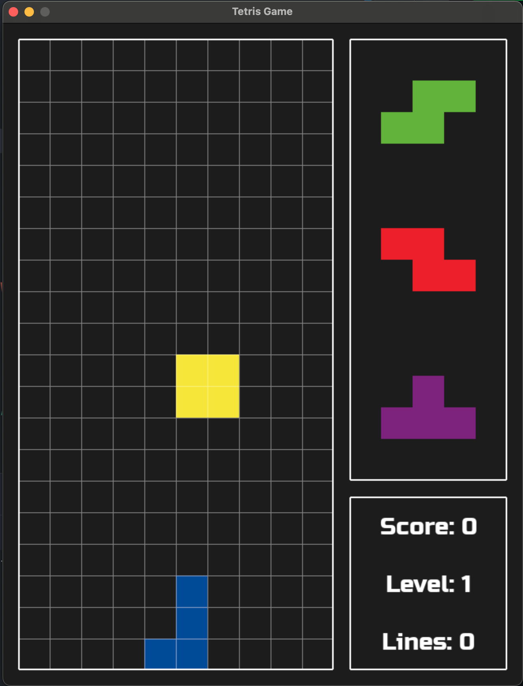

# Tetris Game

Це репозиторій гри **Tetris**, створений користувачем.

## Опис
Проєкт містить реалізацію класичної гри Tetris на Python.

## Скриншот
)

## Запуск

```bash
python main.py
```

## Структура проєкту
- `main.py` — основний файл гри
- `.gitignore` — правила ігнорування файлів для Git
- `README.md` — документація проєкту
